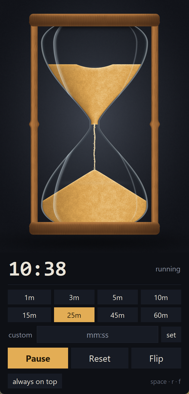

# Hourglass Timer

A desktop countdown timer for Windows whose face is a hourglass: the sand
level in the upper bulb tracks the time you have left, a stream of grains falls
through the neck while it runs, a cone builds up underneath, and the whole piece
turns over when you flip it.



## Setup

The virtual environment is not in the repository, so create it once after
cloning. On **Windows**:

```
git clone https://github.com/xmxhuihui/realistic_hourglass.git
cd realistic_hourglass
python -m venv .venv
.venv\Scripts\python.exe -m pip install -r requirements.txt
```

If `python` is not on your PATH, use the launcher that ships with the
python.org installer instead: `py -3 -m venv .venv`.

On **macOS / Linux**:

```
git clone https://github.com/xmxhuihui/realistic_hourglass.git
cd realistic_hourglass
python3 -m venv .venv
.venv/bin/python -m pip install -r requirements.txt
```

You do not need to *activate* the environment. Every command here — and
`run.bat` — calls the interpreter by path, so there is no `activate` step and no
PowerShell execution-policy detour.

If you would rather not use a virtual environment at all, install the two
packages into whatever Python is on your PATH with
`python -m pip install numpy pillow`; `run.bat` falls back to that automatically.

## Running it

Double-click **`run.bat`**, or:

```
.venv\Scripts\pythonw.exe hourglass_timer.py       # Windows
.venv/bin/python hourglass_timer.py                # macOS / Linux
```

`run.bat` uses `.venv` if it is present and otherwise falls back to the
`pythonw` on your PATH.

### A desktop shortcut

On Windows, one command puts a double-click launcher on your desktop:

```
powershell -ExecutionPolicy Bypass -File make_shortcut.ps1
```

That creates **Hourglass Timer** on the desktop, aimed at
`.venv\Scripts\pythonw.exe` rather than at `run.bat` so no console window flashes
on launch, and wearing `hourglass.ico` — an icon rendered by `sand_render.py`
itself. The shortcut stores absolute paths, so run the script again if you move
the project folder.

## Using it

| Control | What it does |
| --- | --- |
| **Start / Pause** | Runs or holds the countdown (`space`) |
| **Reset** | Back to the full duration (`r`) |
| **Flip** | Turns the glass over: what has run out becomes the time remaining (`f`) |
| Preset chips | 1 to 60 minutes |
| `custom` box | `90` (minutes), `5:30`, or `1:02:30`, then **set** or Enter |
| Click the hourglass | Flips it |
| Scroll over the hourglass | Adds or removes a minute while it is stopped |
| **always on top** | Keeps the window above other apps |

When the time runs out the glass empties, the clock flashes and a short chime
plays. **Restart** (or a flip) starts it again.

## Requirements

* Python 3.9 or newer with Tkinter (the standard python.org installer includes it)
* `numpy` — required
* `pillow` — optional; it roughly triples the frame rate of the canvas blit and
  is used for the flip animation. Without it the app falls back to a built-in
  PNG encoder and runs at a lower frame rate.

See [Setup](#setup) for the install commands.

It is written for Windows but does run on macOS and Linux: the Windows-only
calls are all guarded, so the DPI hint becomes a no-op and the completion chime
falls back to the terminal bell. You lose `run.bat`, Segoe UI and Consolas give
way to Tk's default fonts, and on Linux the scroll-to-change-duration shortcut is
inert because X11 does not send Tk's `<MouseWheel>` event.

## How the hourglass is drawn

`sand_render.py` renders every frame from scratch with numpy — there are no
image assets. Shapes are signed distance fields, so edges come out antialiased
without supersampling, and glass, wood and sand are shaded analytically:

* **Silhouette** — the bulb half-width swells out of the neck as a sine curve,
  is widest four fifths of the way up, then rolls over into the shoulder that
  meets the wooden plate.
* **Sand levels** track *volume*, not height. The bulbs are far wider than the
  neck, so a level moving at a constant speed would look wrong; a table built at
  start-up maps a fill fraction to the level that covers that much area. The
  upper surface carries a funnel-shaped crater above the neck, the lower one is
  a cone at the angle of repose.
* **The stream** is a narrow wobbling column textured with scrolling noise, plus
  a few dozen loose grains that fall under gravity and land on the cone.
* **Glass** is a faint tint that thickens toward the walls, a rim light, and
  specular streaks whose offset from the axis only partly follows the
  silhouette — a highlight that tracked it exactly would pinch shut at the waist
  and read as smoke rather than reflected light.

Everything static is baked once at start-up, and a frame is then
`static + (sand alpha x glass transmission) x (sand - backdrop)` over the
bounding box of the bulbs only. Drawing stops completely while the timer is
paused, so an idle timer costs no CPU.

## Files

```
hourglass_timer.py   timer logic and the Tk interface
sand_render.py       the renderer (standalone; no Tk dependency)
run.bat              launcher
make_shortcut.ps1    puts a shortcut to it on the desktop (Windows)
hourglass.ico        the shortcut's icon, rendered by sand_render.py
```
